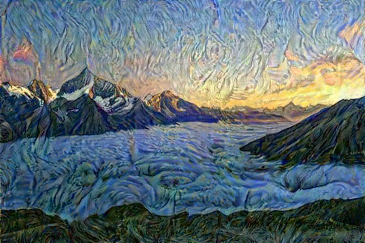
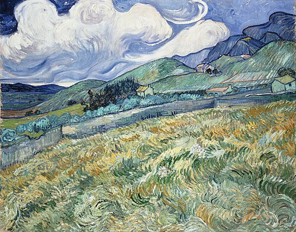

readme_content = '''# Neural Style Transfer with Multi-Image Style Averaging

Transform photos into artwork using deep learning! This project implements neural style transfer from scratch, with a unique twist: it averages style representations from **multiple artworks** to capture a more robust artistic style.



## 🎨 What is Neural Style Transfer?

Neural style transfer uses Convolutional Neural Networks (CNNs) to:
- Extract **content** (objects, structure) from one image
- Extract **style** (textures, colors, brush strokes) from another image
- Generate a new image that combines both

## 🚀 Key Innovation: Multi-Image Style Averaging

Unlike traditional implementations that use a single style image, this project:
1. Extracts Gram matrices (style representations) from **multiple style images**
2. **Averages** these Gram matrices to create a blended style
3. Produces results that capture the essence of an artistic style more robustly

This approach is particularly useful when you want to capture the style of an artist (e.g., Van Gogh) rather than copying a single painting.

## 🛠️ Technical Implementation

### Core Concepts

**1. Feature Extraction**
- Uses pre-trained VGG19 network
- Extracts features at multiple convolutional layers
- Early layers capture textures, deeper layers capture structure

**2. Gram Matrix for Style**
```python
# Captures correlations between feature maps
# Represents "co-occurrence" of visual patterns
gram = torch.mm(features, features.transpose())
```

**3. Loss Functions**
- **Content Loss**: MSE between feature maps (preserves structure)
- **Style Loss**: MSE between Gram matrices (matches artistic style)
- **Total Variation Loss**: Reduces noise for smoother output

**4. Optimization**
- Uses gradient descent on **image pixels** (not model weights!)
- Starting point: content image
- Goal: minimize combined loss function

### Architecture
```
Input Image → VGG19 Layers → Feature Maps → Gram Matrices
                                    ↓
                        Loss Calculation (Content + Style + TV)
                                    ↓
                        Backpropagate to Image Pixels
                                    ↓
                            Updated Image
```

## 📋 Requirements
```bash
torch>=1.9.0
torchvision>=0.10.0
PIL
matplotlib
numpy
```

## 🎯 Usage

### Basic Usage
```python
import torch
from neural_style_transfer import neural_style_transfer, load_image
import torchvision.models as models

# Setup
device = torch.device("cuda" if torch.cuda.is_available() else "cpu")
vgg = models.vgg19(pretrained=True).features.to(device).eval()

# Load images
content = load_image('content.jpg', device=device)
styles = [
    load_image('van_gogh_1.jpg', device=device),
    load_image('van_gogh_2.jpg', device=device),
    load_image('van_gogh_3.jpg', device=device)
]

# Run style transfer
result = neural_style_transfer(
    content_img=content,
    style_images=styles,
    vgg_model=vgg,
    style_layers=[0, 5, 10, 19, 28],
    content_layer=21,
    num_steps=1000,
    style_weight=1e8,
    content_weight=1,
    tv_weight=1e-5
)
```

### Hyperparameter Tuning

- **style_weight**: Higher = more artistic style (try 1e7 to 1e9)
- **content_weight**: Higher = preserve more original structure (usually 1)
- **tv_weight**: Higher = smoother output (try 1e-6 to 1e-4)
- **num_steps**: More steps = better quality but slower (500-2000)

## 📊 Results

| Content | Style | Output |
|---------|-------|--------|
|  |  |  |

### Performance
- **GPU (T4)**: ~2-3 minutes for 1000 iterations at 400px
- **CPU**: ~20-30 minutes for same settings

## 🧠 What I Learned

1. **CNN Feature Extraction**: How different layers capture different levels of abstraction
2. **Gram Matrices**: Mathematical representation of artistic style through feature correlations
3. **Loss Function Design**: Balancing multiple objectives (content, style, smoothness)
4. **Gradient Descent on Images**: Optimizing pixels directly rather than model weights
5. **Multi-Image Aggregation**: Averaging representations to capture broader style patterns

## 🎓 Educational Value

This project demonstrates:
- ✅ Deep understanding of CNNs beyond classification
- ✅ Custom loss function implementation
- ✅ Gradient-based optimization techniques
- ✅ Creative application of deep learning
- ✅ PyTorch proficiency

## 🔧 Project Structure
```
neural-style-transfer/
│
├── neural_style_transfer.py    # Main implementation
├── README.md                    # This file
├── requirements.txt             # Dependencies
│
├── images/
│   ├── content.jpg             # Input photo
│   ├── style_0.jpg             # Style image 1
│   ├── style_1.jpg             # Style image 2
│   └── style_2.jpg             # Style image 3
│
└── outputs/
    └── stylized_output.png     # Generated result
```

## 📚 References

- [A Neural Algorithm of Artistic Style](https://arxiv.org/abs/1508.06576) - Gatys et al., 2015
- [Image Style Transfer Using Convolutional Neural Networks](https://www.cv-foundation.org/openaccess/content_cvpr_2016/papers/Gatys_Image_Style_Transfer_CVPR_2016_paper.pdf) - Gatys et al., 2016

## 🤝 Future Improvements

- [ ] Real-time style transfer using feed-forward networks
- [ ] Video style transfer with temporal consistency
- [ ] Interactive web interface
- [ ] Style interpolation between multiple artists
- [ ] Arbitrary style strength control

## 📝 License

MIT License - Feel free to use for learning and projects!

## 👤 Author

**[Shivanshika Agarwal]**
- GitHub: [@yourusername](https://github.com/ShivanshikaAgarwal1505)
---

⭐ If you found this project helpful, please consider giving it a star!
'''


## Requirements
'''torch>=1.9.0
torchvision>=0.10.0
Pillow>=8.0.0
matplotlib>=3.3.0
numpy>=1.19.0
'''
